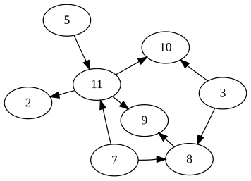
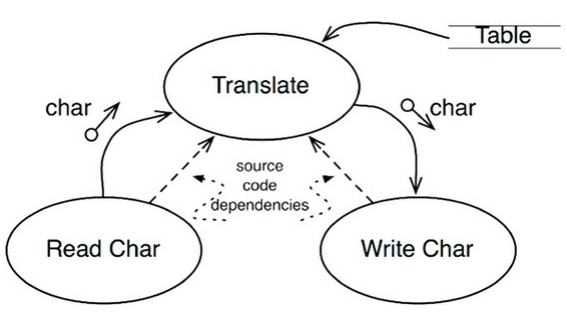
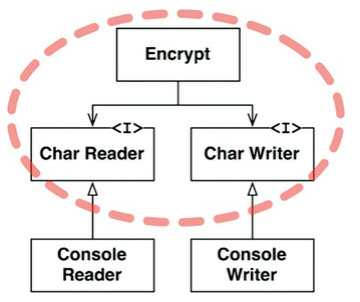
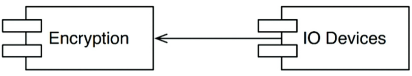

基本上，所有的軟體都是一組策略聲明。簡單來說電腦程式就是一組仔細描述如何將輸入轉為輸出的策略聲明的集合。

大多數非小型的系統中，整體業務策略通常會細分為多組更小的策略聲明。
- 用於描述計算部份的業務邏輯。
- 負責描述計算報告的格式。
- 描述如何驗證輸入資料的策略。

程式架構設計的重點。
- 將策略彼此分離，按照變更的方式重新分組。
- 變更原因、時間和層次相同的策略應該被分到同一個元件。

架構設計的工作常常需要將元件重排組合成為一個有向無環圖。

<div align="center">
  <br>
  圖 19.1
</div><br>

圖 19.1 中的每一個節點代表的是一個擁有相同層次策略的元件，每一個單向連結都代表了一種元件之間的依賴關係，它們將不同層級的元件連結起來。

這裡的依賴關係是指程式碼層次上、編譯期的依賴關係。
- 在 Java 語言中就是指 import 陳述句。
- 在 C# 語言中就是指 using 陳述句。
- 在 Ruby 語言中就是指 require 語句。
這些依賴關係都是在編譯過程中所必需的。

一個設計良好的架構中，依賴關係的方向通常取決於它們所關聯的元件層次。一般來說，低層組件被設計為依賴高層組件。


## Level（層次）

「層次」是嚴格按照「輸入與輸出之間的距離」來定義的。一個策略距離系統的輸入/輸出越遠，它所屬的層次就越高。而直接管理輸入/輸出的策略在系統中的層次是最低的。

### 高層次與低層次元件的概念

- 高層次元件：通常與具體的實作細節無關，專注於抽象邏輯或業務邏輯。它們不直接依賴於輸入或輸出的細節，而是依賴於較低層次的元件來完成這些任務。
- 低層次元件：與具體的實作細節密切相關，處理直接的硬體操作、I/O 或資料流操作，通常是與外部世界（像是使用者、硬體設備）互動的元件。

### 架構圖中的高低層次解釋

圖 19.2 是一個簡單加密程式的資料流向圖，該程式從輸入裝置讀取字符，然後用查表法轉換這些字符並將轉換後的字符輸出到輸出裝置。我們將圖中資料的流向用彎曲實心箭頭標識了出來，而對於經精妙設計過的源碼中的依賴關係則使用直虛線來標識。

<div align="center">
  <br>
  圖 19.2
</div><br>

- Translate 是高層次元件：該元件與具體的 I/O（輸入/輸出）操作無關。它專注於字元的「轉換」，這是一種抽象邏輯。Translate 不直接處理如何讀取字元或寫入字元，而是依賴低層次的 Read Char 和 Write Char 來完成這些任務。
- Read Char 和 Write Char 是低層次元件：這兩個元件與具體的 I/O 操作直接相關。Read Char 負責從某個來源（例如：鍵盤、檔案）讀取字元，Write Char 則負責將字元寫到某個目的地（例如：螢幕、檔案）。這些操作屬於具體的實作細節，因此是低層次元件。

但我們很容易將這個加密程式寫成下面這樣，這就構成了一個不正確的架構：

```c
function encrypt() {
    while (true)
        writeChar(translate(readChar()));
}
```

### 為何架構不正確

- 過度依賴低層次元件：根據圖 19.2 中的架構，Translate 與 Read Char 和 Write Char 之間有「source code dependencies」（原始碼依賴）。這意味著 Translate 依賴於具體的 I/O 操作（Read Char 和 Write Char），這導致高層次元件對低層次元件的依賴性過高。

    - 理想的架構應該是高層次元件不依賴低層次元件，反而應該是低層次元件依賴高層次元件來完成具體的任務。這樣可以讓高層次邏輯更加獨立，易於修改和擴展，而不受具體的輸入/輸出限制。

- 反轉依賴原則（Dependency Inversion Principle, DIP）違反：DIP 是一個常見的設計原則，強調高層次元件不應該依賴低層次元件，而是雙方都應該依賴於抽象（例如接口）。這裡 Translate 直接依賴了具體的 I/O 操作，違反了這個原則。

### 改進建議：

<div align="center">
  <br>
  圖 19.3
</div><br>

圖 19.3 中展示了一個基於依賴倒轉原則（Dependency Inversion Principle, DIP）的設計，這個原則的核心理念是「高層次模組不應該依賴低層次模組，兩者都應依賴於抽象」。透過依賴注入或接口設計來隔離 Translate 與具體的 I/O 操作。

例如，Translate 可以依賴抽象的接口，而具體的 Read Char 和 Write Char 則實現這些接口。這樣可以讓高層次邏輯不依賴於具體的實作細節，使架構更具彈性。

<details>
    <summary>箭頭圖示說明</summary>
    
1. Encrypt 到 Interface 的箭頭（Encrypt 依賴 ICharReader 和 ICharWriter）
    - 箭頭是實線，代表依賴關係。
    - Encrypt 直接 依賴 於 ICharReader 和 ICharWriter，這表示 Encrypt 會使用這兩個接口來進行操作。Encrypt 需要透過這兩個接口來執行具體的字元讀寫工作。
2. Console Reader/Writer 到 Interface 的箭頭（ConsoleCharReader 和 ConsoleCharWriter 依賴接口）
    - 箭頭是虛線，表示實作或繼承關係。
    - ConsoleCharReader 和 ConsoleCharWriter 這兩個具體實作了 ICharReader 和 ICharWriter 接口，表示它們提供了這些接口的方法的具體實作。

</details>

<details>
    <summary>依賴方向說明</summary>

- 圖 19.3 中，高層次的元件是 Encrypt，它依賴於兩個抽象的元件：Char Reader 和 Char Writer。
- Char Reader 和 Char Writer 是具體的操作（如讀取字元和寫入字元），但它們並非直接依賴於具體的實現，如 Console Reader 或 Console Writer，而是依賴於接口（I）。
- Console Reader 和 Console Writer 是具體的實作，它們實現了 Char Reader 和 Char Writer 的接口。
- 這樣做的目的是：
    1. Encrypt 作為高層次邏輯，僅依賴抽象（接口 ICharReader 和 ICharWriter），而不依賴具體的輸入/輸出操作（例如從控制台讀取或寫入）。
    2. 如果將來需要改變具體的 I/O 實現（例如從檔案讀取字元而不是從控制台），可以通過替換 Char Reader 和 Char Writer 的具體實現來實現，Encrypt 不需要任何改動。

</details>

<details>
    <summary>程式碼範例</summary>

定義接口（抽象）
```c
public interface ICharReader
{
    char ReadChar();
}

public interface ICharWriter
{
    void WriteChar(char c);
}
```

低層次組件（具體實作）
```c
public class ConsoleCharReader : ICharReader
{
    public char ReadChar()
    {
        // 假設從控制台讀取一個字元
        return Console.ReadKey().KeyChar;
    }
}

public class ConsoleCharWriter : ICharWriter
{
    public void WriteChar(char c)
    {
        // 將字元寫入控制台
        Console.Write(c);
    }
}
```

高層次組件（邏輯）
```c
public class Encrypt
{
    private readonly ICharReader _reader;
    private readonly ICharWriter _writer;

    public Encrypt(ICharReader reader, ICharWriter writer)
    {
        _reader = reader;
        _writer = writer;
    }

    public void PerformEncryption()
    {
        while (true)
        {
            // 讀取字元、加密（假設這裡做了某種轉換或加密操作）
            var c = _reader.ReadChar();
            var encryptedChar = Translate(c); // 假設這是加密邏輯
            _writer.WriteChar(encryptedChar);
        }
    }

    private char Translate(char c)
    {
        // 簡單示範：將字元轉換為下一個字母（例如：a -> b）
        return (char)(c + 1);
    }
}
```

執行範例
```c
class Program
{
    static void Main()
    {
        // 使用 ConsoleCharReader 和 ConsoleCharWriter 作為具體實現
        ICharReader reader = new ConsoleCharReader();
        ICharWriter writer = new ConsoleCharWriter();
        
        Encrypt encrypt = new Encrypt(reader, writer);
        encrypt.PerformEncryption();
    }
}
```

</details>

### 依賴倒轉的具體原則

- 高層次模組（Encrypt）依賴於抽象：Encrypt 只知道 ICharReader 和 ICharWriter，不需要知道具體的實現。
- 低層次模組依賴於抽象：Console Reader 和 Console Writer 這些低層次實作依賴於接口（ICharReader 和 ICharWriter），它們負責具體的行為實作。
- 這樣的設計使得高層次模組和低層次模組之間的依賴不再是單向的（即高層模組依賴低層模組），而是透過抽象來進行解耦，實現依賴的倒轉。

- 透過依賴倒轉原則，我們使 Encrypt 依賴於介面（ICharReader 和 ICharWriter），這樣未來如果要替換具體的 Reader 或 Writer 實作（例如從檔案讀取或寫入），只需要實現新的類別即可，而不需要修改 Encrypt 類別。
- 這種設計提高了系統的彈性和可維護性，讓高層邏輯與低層細節實現解耦。

### 策略分組

如同開頭所提到的，我們應該根據策略發生變更的方式將它們分成不同的元件。變更原因和變更時間相同的策略應在 SRP 和 CCP 這兩個原則的指導下合併為同一組件。離輸入/輸出最遠的策略—高層策略—一般變更沒有那麼頻繁。即使發生變更，原因也比低層策略所在的元件更重大。反之，低層策略則很有可能會頻繁地進行一些小變更。

<details>
    <summary>SRP 和 CCP 補充</summary>

1. SRP - 單一職責原則（Single Responsibility Principle）
    - SRP 的核心理念是每個模組或類別應僅負責一個職責。也就是說，一個類別或模組應該只有一個引起它變更的原因。如果一個類別承擔了過多的職責，當其中一個職責發生變更時，這個類別就需要被修改，導致程式碼變得不穩定、難以維護。
    - 範例：
        - 假設有一個類別 Employee，既負責處理員工的薪資計算邏輯，又負責將員工資料儲存到資料庫。這樣一來，如果薪資計算邏輯發生變化，或是資料庫邏輯變更，Employee 類別都需要被修改，違反了 SRP。
        - 改進：將薪資計算邏輯和資料庫保存邏輯分離到不同的類別中，這樣每個類別只負責一個職責，遵循了 SRP。
2. CCP - 共同封閉原則（Common Closure Principle）
    - CCP 的意思是應該把那些因為相同的原因而同時變化的類別封裝到同一個元件中。換句話說，一個元件中的所有類別應該一起修改，因為它們共享相同的變更原因。這樣可以減少對組件的修改次數，提升系統的穩定性。
    - 範例：
        - 假設我們有一個模組管理不同的使用者角色和權限。如果每次權限模型變更時，需要修改多個類，那麼這些類別應該在同一個元件中，因為它們的變更原因是一致的。

總結：
- SRP 關注的是每個類別的職責，確保每個類別只做一件事。
- CCP 關注的是組件的封閉性，確保由於相同原因變更的類別在一個組件中。

</details><br/>

<div align="center">
  <br>
  圖 19.4
</div><br>

<details>
    <summary>箭頭圖示說明</summary>
    
1. 圖 19.4 中的箭頭是 從 IO Devices 指向 Encryption，這表明 IO Devices 依賴 Encryption。
2. IO Devices 知道並依賴於 Encryption，但 Encryption 並不依賴 IO Devices。這是依賴倒轉原則中的重要概念——高層次的組件不應該依賴低層次的具體實現。

</details>

<details>
    <summary>程式碼範例</summary>

```c
public interface IIODevices
{
    char Read();
    void Write(char c);
}

public class ConsoleIODevices : IIODevices
{
    public char Read()
    {
        // 讀取控制台的輸入
        return Console.ReadKey().KeyChar;
    }

    public void Write(char c)
    {
        // 輸出到控制台
        Console.Write(c);
    }
}

public class Encryption
{
    public char EncryptChar(char c)
    {
        // 簡單的加密邏輯，將字元轉換為下一個字母
        return (char)(c + 1);
    }
}

public class IOHandler
{
    private readonly IIODevices _ioDevices;
    private readonly Encryption _encryption;

    public IOHandler(IIODevices ioDevices, Encryption encryption)
    {
        _ioDevices = ioDevices;
        _encryption = encryption;
    }

    public void ProcessIO()
    {
        char input = _ioDevices.Read();
        char encrypted = _encryption.EncryptChar(input);
        _ioDevices.Write(encrypted);
    }
}

class Program
{
    static void Main()
    {
        IIODevices consoleIO = new ConsoleIODevices();
        Encryption encryption = new Encryption();

        IOHandler ioHandler = new IOHandler(consoleIO, encryption);
        ioHandler.ProcessIO();
    }
}
```
</details><br>

總結：
- Encryption 不需要知道 IO Devices 的具體實作。它只專注於加密邏輯。
- IO Devices（例如 ConsoleIO）依賴於 Encryption 來處理讀取到的數據。
- 這樣的設計遵循了依賴倒轉原則，保持了高層邏輯與具體實作之間的解耦，提供了靈活性和可維護性。

<br>

## CONCLUSION 本章小結
本章針對策略的討論涉及單一職責原則（SRP）、共同閉包原則（CCP）、依賴反轉原則（DIP）。