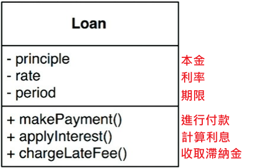
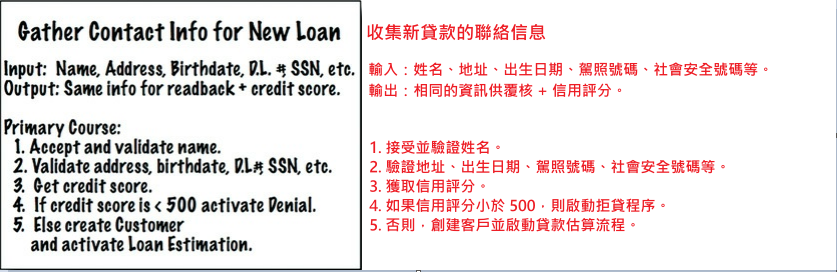

在應用程式中，我們經常會把程式劃分成業務邏輯和插件等不同部分。這裡的「業務邏輯」指的是那些對企業賺錢或節省成本有直接影響的邏輯。

舉個例子，銀行會根據一定的利率收取貸款的利息，這就是銀行賺錢的方式之一。無論這個利息是由電腦自動計算，還是由銀行職員手動計算，其實對賺錢這個過程來說，都是一樣的。這種涉及企業核心收入的邏輯，我們稱為「關鍵業務邏輯」。

「關鍵業務邏輯」通常會涉及到一些必須的數據，例如，針對貸款的邏輯，我們需要知道貸款金額、利率和還款計畫等信息。這些數據被稱為「關鍵業務數據」，因為不論是人工操作還是通過電腦來實現，這些數據都是必須存在的。

因為「關鍵業務邏輯」和「關鍵業務數據」是密不可分的，它們通常會放在同一個物件裡處理，而這種物件通常叫作「業務實體（Entity）」。

> 簡單就是說應用程式中的業務邏輯是企業賺錢或省錢的核心，無論是自動化還是人工執行，這些邏輯和數據都是必不可少的。將業務邏輯和業務數據放在一起，就是我們所謂的「業務實體」。


## ENTITIES 業務實體

「業務實體」是指在電腦系統中的一種對象，它包含一系列用來操作關鍵資料的業務邏輯。這些實體物件要么直接包含了這些關鍵業務數據，要么能夠輕鬆訪問這些數據。實體的介面主要由那些負責執行業務邏輯、處理關鍵業務資料的函數組成。

<div align="center">
  <br>
  圖20.1
</div><br>

例如，圖 20.1 中展示了一個「借貸」業務對應的業務實體類別 Loan 的 UML 圖。在這個類別中，你可以看到三個關鍵的業務數據，並且有三個操作這些數據的函數，這些函數實現了其關鍵業務邏輯。

創建這樣的類別，實際上是在將這個關鍵業務的具體實現聚集到一個單一的模組中，並將它與系統中其他部分（如資料庫、使用者介面、第三方框架）隔離開來。這個類別只負責代表該業務邏輯，並且不關心資料如何被儲存、系統如何呈現給使用者或如何運作。簡而言之，「業務實體」這個概念應該只關注業務邏輯，與其他部分無關。

> 這裡雖然是把業務實體定義為一個類別，但事實並非如此。業務實體並不一定要用物件導向的方式來實現，這個概念只是要求我們將關鍵的業務資料和業務邏輯封裝在一個獨立的軟體模組內即可。

## USE CASES 用例

並非所有的業務邏輯都屬於「業務實體」。有些業務邏輯是專門針對自動化系統設計的，它們無法由人工來完成，必須通過系統來實現，這些邏輯屬於自動化系統中的業務流程控制。

例如，假設銀行有一個應用程式讓職員為客戶創建貸款。這個程式可能規定，職員必須先收集並驗證客戶的聯絡信息，確保客戶的信用評分超過500，然後才能進行貸款還款的預估。這就需要銀行在系統設計時確保兩點：一，客戶必須能夠通過系統輸入聯絡信息並通過驗證；二，只有信用評分符合要求時，客戶才能看到還款預估值。

這種描述實際上就是一個「用例」。用例是描述如何操作自動化系統的一個工具，定義了使用者需要提供的輸入、應得到的輸出，以及為了產生這些輸出所需的操作步驟。用例並非屬於業務實體的核心業務邏輯，而是特定應用場景下的操作流程。

例如，圖 20.2 中展示了一個用例，其中提到的「客戶」就是業務實體，它負責處理銀行與客戶之間的關係。

<div align="center">
  <br>
  圖20.2
</div><br>

<details>
    <summary>程式碼範例</summary>

```c
public class LoanApplication
{
    public string Name { get; set; }                    //  姓名
    public string Address { get; set; }                 //  地址
    public DateTime Birthdate { get; set; }             //  出生日期
    public string DLNumber { get; set; }                //  駕照號碼
    public string SSN { get; set; }                     //  社會安全號碼
    public int CreditScore { get; set; }                //  信用評分
    public bool IsLoanEligible { get; private set; }    //  是否符合貸款條件

    //  建構函式
    public LoanApplication(string name, string address, DateTime birthdate, string dlNumber, string ssn)
    {
        Name = name;
        Address = address;
        Birthdate = birthdate;
        DLNumber = dlNumber;
        SSN = ssn;
    }

    //  驗證聯絡資訊
    public bool ValidateContactInfo()
    {
        //  驗證邏輯
        return !string.IsNullOrEmpty(Name) &&
               !string.IsNullOrEmpty(Address) &&
               !string.IsNullOrEmpty(DLNumber) &&
               !string.IsNullOrEmpty(SSN);
    }

    //  檢索信用評分（存根函數，替換為實際邏輯）
    public void GetCreditScore()
    {
        // 模擬獲取信用評分，實際情況應通過某種API或數據庫查詢獲得
        CreditScore = new Random().Next(300, 850);      // 假設信用評分在300到850之間
        Console.WriteLine($"{Name} 的信用評分：{CreditScore}。");
    }

    //  處理貸款申請
    public void ProcessLoanApplication()
    {
        //  驗證聯絡資訊
        if (!ValidateContactInfo())
        {
            Console.WriteLine("聯絡資訊驗證失敗。");
            return;
        }

        //  檢索信用評分
        GetCreditScore();
        
        if (CreditScore < 500)
        {
            //  拒絕
            ActivateDenial();
        }
        else
        {
            CreateCustomer();
            ActivateLoanEstimation();
        }
    }

    //  拒絕貸款
    private void ActivateDenial()
    {
        IsLoanEligible = false;
        Console.WriteLine("貸款申請因信用評分低而被拒絕。");
    }

    //  建立客戶記錄
    private void CreateCustomer()
    {
        Console.WriteLine("已建立客戶記錄。");
    }

    //  啟動貸款估算
    private void ActivateLoanEstimation()
    {
        IsLoanEligible = true;
        Console.WriteLine("貸款估算流程已啟動。");
    }
}

class Program
{
    static void Main(string[] args)
    {
        //  模擬客戶的聯絡信息
        LoanApplication loanApp = new LoanApplication(
            "John Doe",
            "123 Main St",
            new DateTime(1985, 6, 15),
            "D1234567",
            "123-45-6789"
        );

        //  處理貸款申請
        loanApp.ProcessLoanApplication();
    }
}
```
</details><br>

總結來說，用例控制了業務實體之間的互動方式。它並不關注使用者介面，也不涉及系統的具體交互方式，因此，我們從用例中無法看出系統是在 Web 平台上運行，還是以其他方式交付的。用例只描述了業務邏輯，而不是界面或交付方式。

在系統中，用例也是一個物件，它包含實現特定應用場景的業務邏輯、輸入和輸出資料，以及業務實體的引用。這樣，用例就能夠調用業務實體來實現其業務邏輯。

業務實體不需要知道是哪個用例在控制它們，這就是依賴反轉原則（DIP）的應用。業務實體作為高層概念，不應依賴用例這樣的低層概念；相反，用例這樣的低層概念需要依賴業務實體這樣的高層概念。

## REQUEST AND RESPONSE MODELS 請求和回應模型

在大多數情況下，用例會接收輸入數據，並產生輸出數據。但在一個設計良好的架構中，用例物件不應該知道數據是如何展示給使用者或其他元件的。我們當然不希望在用例類別的程式碼中出現 HTML 或 SQL。

這種獨立性非常重要，因為如果請求和回應模型與其他元件耦合，這些用例就會依賴於這些模型所帶來的各種依賴關係。

有些人可能會覺得可以在資料結構中直接使用業務實體物件，因為業務實體與請求和回應模型之間有很多相同的數據。但這是不應該的！這兩個對象的存在意義完全不同，隨著時間推移，它們會因不同的原因和不同的變更速率而發生改變。如果將它們整合在一起，就違反了共同封閉原則（CCP）和單一職責原則（SRP）。這樣做最終可能會導致程式碼中出現大量的分支判斷和中間數據處理，讓程式變得複雜。

## CONCLUSION 本章小結
本章針對策略的討論涉及單一職責原則（SRP）、共同閉包原則（CCP）、依賴反轉原則（DIP）。