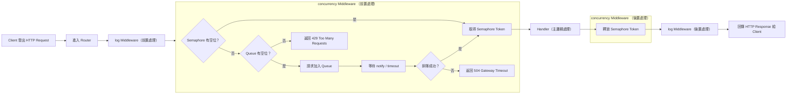

ref:[CHAPTER 06：DESIGN A KEY-VALUE STORE.md](https://github.com/Admol/SystemDesign/blob/main/CHAPTER%2006%EF%BC%9ADESIGN%20A%20KEY-VALUE%20STORE.md)


## 設計鍵值儲存系統

鍵值儲存系統(key-value store)是一種非關聯式資料庫。
每個鍵(key)都是唯一而不重複的標識符號，它會與相應的值(value)一起儲存起來。
這種成對的資料，就是所謂的「鍵值對」(key-value pair)。

「鍵值對」其中的鍵(key)，一定是唯一而不重複的，因此只要透過這個鍵(key)，就可以存取到對應的值(value)。
鍵有可能是一般純文字，也可以是雜湊值(hash value)。基於效能上的理由，比較短的鍵(key)效率會更好一些，鍵究竟是長什麼樣子呢？這裡有幾個例子：

- 純文字鍵： "last_logged_in_at"
- 雜湊值鍵： 253DDEC4

「鍵值對」其中的值(value)，有可能是字串、列表、物件等。
在各種鍵值儲存系統中(例如 Amazon dynamo、Memcached、Redis 等)，「值」通常被視為不透明(opaque)的物件。
下面顯示的就是鍵值儲存系統裡的一段資料：

| Key (鍵) | Value (值) |
|----------|------------|
| 145      | john       |
| 147      | bob        |
| 160      | julia      |

本章要求你設計一個鍵值儲存系統，它可以支援這些操作：

- put(key, value) // 插入一組與「key」鍵相關連的 「value」值
- get(key)        // 取出與「key」鍵相關連的「value」值


## 瞭解問題並確立設計的範圍

天底下沒有完美的設計。每一種設計都必須在記憶體讀取、寫入與使用方面進行取捨，以達到某種特定的平衡。在一致性與可用性之間，也需要進行權衡取捨。我們會在本章設計出一套鍵值儲存系統，它具備了以下的特性：

- 鍵值對尺寸很小：小於 10 KB。
- 有能力儲存大數據資料。
- 高可用性：即使發生故障，系統也可以快速回應。
- 高擴展性：系統可進行擴展，以支援大型資料集。
- 自動擴展：應該可以根據流量，自動添加/移除伺服器。
- 可調整系統一致性程度。
- 低延遲。


## 單一伺服器的鍵值儲存系統

在單一伺服器開發出一個鍵值儲存系統，其實很容易。其中一種很直觀的做法，就是把「鍵值對」全都保存在記憶體裡的雜湊表之中。雖然記憶體的存取速度很快，但由於空間上的限制，要把所有內容全都放入記憶體，有可能是辦不到的事。這時我們就可以採用兩種最佳化的做法，好讓單一伺服器容納更多的資料：

- 資料壓縮
- 只把常用資料放在記憶體，其餘則放到磁碟中

即使採用這些最佳化的做法，單一伺服器還是有可能很快就達到容量的限制。這時就需要採用分散式的鍵值儲存系統，以支援更大的資料量。


## 分散式鍵值儲存系統

分散式鍵值儲存系統也稱為分散式雜湊表，這種做法會把「鍵值對」分散到許多伺服器中。
在設計分散式系統時，先瞭解什麼是 CAP 定理(Consistency 一致性、Availability 可用性、Partition tolerance 分區容錯能力)，是一件重要的事。

## CAP 定理

CAP  定理指出，針對以下三個面向：一致性，可用性與分區容錯能力，概念，專門研究在分散式系統中,在同時滿足三個條件的情況下，能夠最大限度的滿足一致性、可用性和分區容錯能力。


整理重點

- 一致性(Consistency)：所有的資料都一致。
- 可用性：所有的資料都可用。
- 分區容錯能力：在分區的情況下，能夠維持一致性和可用性。


---

面試官：

1. 使用者每秒最多只能發出兩則貼文
2. 每天最多只能用同一個IP位置建立10個帳號
3. 每週最多只能用同一部設備領取5次獎勵

限速器好處：

1. 避免DOS(Denial of Service:拒絕服務)攻擊造成資源不足的問題：

    Twitter API: 300/3hr

    Google API: 300/60s

2. 降低成本：

    針對過多的請求作出限制，可以降低伺服器的負擔，讓更多資源分配給具有高優先等級的API。限速的做法對於第三方付費API的公司而言非常重要。例如每次只要用到以下外部API：檢查可用額度、付款、檢索健康記錄等都會被收取一筆費用。以降低成本的角度來說，限制調用次數的做法非常重要。
    案例：

    如果我們使用Google Maps API製作APP給使用者查詢地點與導航服務

    •	**每 1,000 次地圖載入**：收費 $7 美元。

    •	**每 1,000 次地點搜尋 (Places API)**：收費約 $17 美元。

    •	**每 1,000 次導航路線查詢 (Directions API)**：收費約 $5 美元。

    如果沒有限速可能會面臨非常貴的API成本

3. 防止伺服器出現超載：

    可以利用限速器篩選掉網路機器人或是不當使用者來降低負載


## 第一步驟—了解問題並確立設計的範圍

限速器的做法可以採用各種不同演算法來進行實作，每一種演算法都各有其利弊。面試官與應試者之間的互動，有助於釐清所要建立的是哪種類型的網路線速器。

### 面試官與應試者對話

應試者：我們要設計哪一種網路限速器？是客戶端網路限速器，還是伺服端API網路限速器？

面試官：很好的問題。我們就專注於伺服端API網路限速器吧。

應試者：網路限速器是否要根據IP、使用者ID或其他屬性，來限制API請求？

面試官：這個網路限速器應該要足夠靈活，以支援不同的限制規則組合。

應試者：系統的規模有多大？我們要針對新創公司，還是針對擁有龐大使用者的大公司來打造？

面試官：系統必須能夠處理大量請求。

應試者：系統要有能力在分散式環境中正常運作？

面試官：是的。

應試者：這個限速器是單獨的服務，還是應該在應用程式碼中進行實作？

面試官：這個設計決策有你來決定。

應試者：我們需要對受限制的使用者進行通知？

面試官：要。

需求

- 準確限制過多的請求。
- 低延遲。網路限速器不應減慢HTTP的回應時間。
- 盡可能少用一些記憶體。
- 採用分散式的網路限速做法。多部伺服器或多個process行程，可共用同一個網路限速器。
- 異常處理能力。當使用者請求受到限制時，要向使用者顯示明確的異常通知。
- 高容錯能力。如果網路限速器出現任何問題(例如快取伺服器離線)，也不能影響到整個系統。

## 第二步驟—提出高階設計並取得認可

## 限速器要放在哪裡？

- 客戶端實作：
    - 一般來說，在客戶端實作網路限速器比較不可靠，因為客戶端的請求很容易被惡意行為惡搞。而且，我們有可能根本就無法控制客戶端的實作。
- 伺服器端實作：
    - 位於伺服器的網路限速器，直接在ap層處理的限速器

        

    - 中間網路限速器

        

        案例：

        

        假設API只能處理2 req/s 而客戶端卻在一秒鐘內發送了3次請求。前兩次請求會被轉送到API伺服器，但是第三次會被擋下來。並返回一個HTTP 429狀態碼。HTTP 429表示使用者發送過多請求。

        基於雲端微服務的流行趨勢，通常可以在API gateway元件進行實作。API gateway是一種具有完整管理功能的服務，可以支援網路限速、SSL終止、身份驗證、IP白名單等功能，也可以針對靜態內容提供服務。目前我們只需要知道API gateway可以只緣網路限速功能就足夠了。

        在設計網路限速器時，一定要先問自己究竟要在伺服端還是在API閘道器實作限速器？這個問題沒有絕對的答案。答案取決你的公司目前現有的技術、工程資源、優先順序、目標等等。

        以下是一些通用原則：

        - 評估目前現有的技術，例如擅長的程式語言、現有的快取服務等。
        請務必確認目前使用的程式語言是否可以在伺服端有效時做出網路限速器
        - 確認符合業務需求的網路限速演算法。如果你是在伺服端實作所有的功能，就可以完全控制所有使用的演算法。但如果使用的是第三方API gateway，選則上可能就會受到一些限制
        - 如果已經才用微服務架構，而且在設計中也有用到API gateway來執行身份驗證、IP白名單等功能，那麼就可以直接在API gateway添加網路限速功能。
        - 打造自己的網路限速服務，需要花費一些時間。如果並沒有足夠的工程資源來實作網路限速器，也許採用商業化的API gateway是一個更好的選擇。

        ### 重點：

        - 限速器有分客戶端與伺服端
        - 客戶端與服務端中間還有一種元件叫做API gateway的元件可以使用或實作
        - 沒時間或工程資源不足就買商業化的API gateway。

## 網路限速演算法

網路陷入可以用不同的演算法進行實作，而且每一種演算法都有各自的優缺點。本章並不打算專注於演算法，而是從比較高階的角度去理解這些演算法，這樣也有助於我們選擇更符合使用狀況的正確演算法或演算法組合。以下幾種比較受歡迎的演算法列表：

- Token桶 (Token bucket)

    Token桶演算法在網路限速方面受到很廣泛的應用。許多網路公司都是採用這種做法，Amazon與Stripe都是使用這種演算法來限制API請求。

    Token桶演算法的工作原理如下:

    - Token桶指的是先定義好一個容器的容量。Token會以定期的方式、以預設的速度放入桶中。當桶子裝滿後，就不能再繼續放入Token中了。

        

        Token桶的容量為4。重新填入器(Refiller)會以每秒的速度把Token放入桶中。桶子一但裝滿，而外的Token就會滿出來(overflow)。

    - 每個請求都會消耗掉一個Token。每出現一個請求時，我們都會檢查桶子裡有沒有足夠的Token。

        

        1. 如果有足夠的Token，我們就會取出一個Token給每一個請求，然後讓該請求通過。
        2. 如果沒有足夠的Token，該請求就會被丟棄。
    - Token填充消費以及限速邏輯過程

        

        Token桶的大小為4，重新填入的速度為每分鐘4個。

        Token桶演算法會用到兩個參數：

        - 桶子的大小：桶子裡可以放入的最大Token數量
        - 重新填入的速度：定期放入桶中的Token數量

        我們需要多少個桶子？這隨狀況而異，主要取決於限速規則。這裡有一些例子：

        - 不同的API端點通常需要使用不同的桶子。舉例來說，如果可以讓使用者`每秒發佈1則貼文`、`每天增加150個朋友`、`每秒對5則貼文按讚`、那麼每個使用者就需要用到三個桶子。
        - 如果我們需要根據IP位址對請求做出限制，那麼每個IP位址都需要一個桶子。
        - 如果系統每秒最多可以接受10,000個請求，那麼所有請求共用一個桶子就是合理的做法。(如果系統的吞吐量已經是明確的，建立單一桶子會比建立數千個獨立桶子更簡單更有效率)

        優點：

        - 這個演算法很容易進行實作。
        - 以記憶體的使用來說很有效率。
        - Token桶可接受短時間內出現流量爆炸的情況。只要桶子裡還有Token，就可以通過請求。

        缺點：

        - 這個演算法有兩個參數，分別是桶子的大小與Token重新填入的速度。要對這兩個參數做出適當的調整，可能蠻有挑戰性。
- 漏水桶 (Leaking bucket)

    漏水桶演算法與Token桶的做法很類似，其不同之處在於請求是以固定的速度來進行處理。在進行實作時，通常是採用先進先出(FIFO)的佇列。這個演算法的工作原理如下：

    - 每出現一個請求時系統會檢查佇列是否已滿。如果未滿，就把請求添加到queue中
    - 如果queue已滿，這個請求就會被丟棄。
    - 請求會從佇列被拉出來，然後以固定的間隔時間進行處理。

    

    漏水桶演算法會採用以下兩個參數：

    - 桶子大小：也就等於是queue大小。這個queue會把請求保存起來，然後以固定的速度進行處理。
    - 流出的速度：定義的是固定時間間隔(通常是每秒)內處理請求的數量。

    Spotify這家電子商務公司就是使用漏水桶演算法作為網路限速的機制。

    優點：

    - queue大小是有限的，因此提高記憶體的使用效率。
    - 請求是以固定的速度進行處理，因此很適合需要穩定流出的速度(outflow rate)的使用狀況。

    缺點：

    - 如果出現瞬間大量的流量，舊請求就會塞滿queue，此時若未能及時進行處理，新請求的處理速度就會收到影響。
    - 這個演算法有兩個參數。想對這兩個參數做出恰當的調整，也許並沒有那麼容易。
- 固定視窗計數器 (Fixed window counter)

    工作原理：

    - 這個演算法會把時間軸劃分成固定大小的時間視窗，然後指定一個計數器給每個視窗使用。
    - 每個請求都會讓計數器加一。
    - 一但計數器達到預先定義的門檻值，新的請求就會被丟棄，直到下一次新的時間視窗開始，計數器歸零之後才能重新接受新的請求。

    

    時間單位為1s，系統能接受的速度設定為3 req/s。在每秒的視窗中，如果收到3個以上的請求，而外的請求就會被丟棄。

    這個演算法主要的問題是，時間視窗如果突然出現爆多的流量，實際上被接受的請求就有可能超過雲本設定的限制數量。請考慮以下情況：

    

    系統可接受5 req/min請求，在切換到下一分鐘時就會重新設定，在2:00:00~2:01:00之間有5個請求。但如果觀察2:00:30到2:01:30這一分鐘的視窗，會發現一共通過了10個請求也就是已經到達可接受請求的兩倍。

    優點：

    - 以記憶體的使用來說很有效率。
    - 容易理解。
    - 在單位時間視窗結束時，都會重設可用的配額，這種做法對於某些使用狀況來說特別合適。

    缺點：

    - 如果視窗切換時流量激增，就有可能導致系統通過的請求數超過允許的配額。

- 滑動視窗日誌記錄 (Sliding window log)

    因為固定視窗計數器演算法存在一個主要的問題：有可能在視窗切換的前後，接受過多的請求。滑動視窗日誌記錄演算法解決了此問題。

    工作原理：

    - 這個演算法會追蹤請求的時間戳。時間戳資料通常保存在快取(例如Redis的以排序集合)。
    - 如果有新請求進來，就刪除所有過時的時間戳。所謂過時的時間戳，就是比目前時間視窗的開始時間更早的時間戳。
    - 把新請求的時間戳添加到日誌中。
    - 如果日誌記錄的數量等於或小於可接受的數量，就接受請求。否則請求就會被拒絕。

    

    系統能接受2 req/min。通常日誌記錄所儲存的都是UnixTimestamp。

    - 新請求在1:00:01抵達時，日誌是空的。因此請求被接受。
    - 1:00:30 又來了一個請求，因此1:00:30這個時間戳被添加到日誌中。加入這個時間戳後，日誌記錄數量就變為2，還沒有超過可接受數量。因此請求同樣的被接受了。
    - 1:00:50 又來了一個請求，這個時間戳同樣的被加入日誌中。加入這個時間戳之後，日誌記錄的數量就變成3了，超過可接受數量2。因此雖然時間戳還是繼續保留在日誌中，但這個請求會被拒絕。
    - 1:01:40 又來了一個新的請求。從1:00:40到1:01:40這段時間內的請求，都還落在最後一分鐘的範圍內，但1:00:40之前的請求，全部都已經過時了，因此就會從日誌中被移除。移除操作完成之後，日誌記錄的數量就會變回2，於是最新的請求也被接受了。

    優點：

    - 用這個演算法實作出來的限速效果非常準確。在任何滾動的時間視窗內，請求的數量都不會超出限制。

    缺點：

    - 這個演算法會用到大量記憶體，因為即使請求被拒絕，時間戳記還是會被保存在記憶體中。
- 滑動視窗計數器 (Sliding window counter)

    滑動視窗計數器演算法是一種融合”固定視窗計數器”與“滑動視窗日誌記錄”演算法的混合做法。這個演算法可以透過兩種不同的方式來進行實作。

    

    `書上寫7 github寫5`

    假設網路限速器每分鐘最多可接受 7 req/min。

    假設這個限速器前一分鐘已經有5個請求，目前這一分鐘有3個請求。對於目前這一分鐘前30%位置出現的新請求來說，我們可以用以下公式來計算出滾動的一分鐘視窗內請求的數量：

    - 目前視窗內請求的數量＋前一個視窗內請求數量＊滾動視窗與前一個視窗重疊的百分比。
    - 使用此公式，我們就可以得到3+5*0.7%=6.5個請求。根據實際的使用狀況，數字可以選擇無條件進入。採用無條件捨去做法得出結果等於6。

    由於網路限速器每分鐘最多可以接受7個請求，因此目前這個請求還可以被接受。不過如果在收到另一個請求，就會達到限制數量。

    優點：

    - 由於我們是根據前一個視窗平均速度來計算出餐考值，因此他可以減緩流量突然出現高峰的問題。
    - 以記憶體的使用來說很有效率。

    缺點：

    - 這種做法只適用於較寬鬆的回溯視窗。實際上這種做法採用的是實際速度的近似值，因為這裡假設前一個視窗裡的請求，在時間上是均勻分佈。不過，在這個問題或許並不如想像中嚴重。根據cloudflare所做的實驗，在4億次請求中，只有0.003%的請求被錯誤地接受或拒絕。


## 高階架構

網路限速算法的基本架構想法其實很簡單。從比較高階的角度來說，我們需要一個計數器來追蹤同一個使用者、同一個IP位址等等所發送的請求數量。如果數量超過了限制，就不接受該請求。

我們應該要把計數器放哪裡？由於磁碟的儲存速度緩慢，因此使用者資料庫並不是好方法。通常會選擇以記憶體快取主要是因為速度快且支援時間過期，以Redis就是實作網路限速器的常見選擇。Redis把資料保存在記憶體的儲存系統提供兩個指令：INCR與EXPIRE。

- INCR：把已儲存計數器值+1
- EXPIRE：設定計數器的到期時間。如果超過到期時間，計數器就會自動被刪除。


實作網路限速器的高階架構工作原理：

- 客戶端向網路限速器發送請求
- 網路限速器會從Redis相應的桶子裡取的計數器的值，檢查看看有沒有超出限制。
    - 如果超出限制，請求就會被拒絕。
    - 如果未超出限制，就把請求發送到API伺服器。於此同時，系統會把計數器的值+1，然後把值存回Redis

## 第三步驟—深入設計

第二步驟的高階架構設計並沒有回答以下幾個問題：

- 如何建立網路限速器規則？規則要保存在哪裡？
- 因限速而被拒絕的請求，該做什麼樣的處置？

在本節會先回答關於限速規則的問題，然後再介紹如何處理被拒絕請求的策略。最後，我們會討論分散式環境下網路限速的做法、詳細的設計、效能最佳化與監控等主題。

## 限速規則

Lyft公開了他們的限速相關程式碼。因此我們可以窺探其內部程式碼，而且可以從中看到一些限速規則：

```yaml
domain: messaging
descriptors:
  - key: message_type
    Value: marketing
    rate_limit:
      unit: day
      requests_per_unit: 5
```

在上述例子中，系統貝貝摯為每天最多允許5則市場銷售相關訊息。這裡還有另一個範例：

```yaml
domain: messaging
descriptors:
  - key: message_type
    Value: marketing
    rate_limit:
      unit: day
      requests_per_unit: 5
```

這個規則的意思是，客戶端登入的次數一分鐘內不能超過5次。這些規則通常會被寫入設定檔案，然後保存至硬碟中。

## 超出速度限制

如果請求次數超出限制，API就會向客戶端送回HTTP回應碼429(過多請求)。根據不同的使用狀況，我們可能會把這些超出速度限制的請求加入queue中，以便稍後再處理。舉例來說，如果有某些訂單因為系統超載而被限速規則擋下來，我們可能還是要先把這個訂單保留起來，等到隨後在進行處理。

### 網路限速器回應的標頭

---

客戶怎麼知道它有沒有受到限制？客戶怎麼知道還能做出多少次請求，才會受到限制？答案就在HTTP回應的標頭內。網路限速器會把如下的HTTP標頭送回給客戶端：

- X-Ratelimit-Remaining：目前的視窗內，還可接受多少次請求。
- X-Ratelimit-Limit：客戶端在每個時間視窗內可進行多少次請求。
- X-Ratelimit-Retry-After：接下來還要等待幾秒鐘，才能解除限制、再次發送出請求。

如果使用這發送出太多請求，就會有429過多請求的錯誤與X-Ratelimit-Retry-After標頭被送回給客戶。

## 詳細的設計


整個系統詳細設計圖

- 限速規則儲存在硬碟中。Worker工作程序會定期從硬碟取出規則，然後將這些規則儲存到快取中(Cached rules)
- 客戶端向伺服器端發送請求時，這個請求會先被發送到網路限速器。
- 網路限速器會從快取載入規則。然後他會從Redis快取取的計數器的值，以及前一次請求的時間戳。網路限速器可以根據回應做出以下的判斷：
    - 如果請求並沒有受到速度的限制，就會被轉送到API伺服器。
    - 如果請求受到了速度的限制，網路限速器就會把429過多請求的錯誤送回客戶端。於此同時，這個請求也會被丟棄(dropped)，或是轉送到一個queue。

## 分散式環境下的網路限速器

在單一伺服器的環境下，建立網路限速器並不困難。但如果想要擴展系統，支援多個伺服器與平行的執行緒，那就是另外一回事了。這裡會有兩個挑戰：

- 競爭狀況(Race-condition)
- 同步問題(Synchronization issue)

### 競爭狀況

---

如前所述，若從高階角度來看，網路限速器的運作方式如下：

- 從Radis讀取計數器的值。
- 檢查(計數器+1)有沒有超過門檻值。
- 如果沒有，就把Redis裡的計數值+1

在高度平行的環境下，就有可能發生競爭狀況。


假設Redis裡的計數器數值為3。如果有兩個請求都在寫回計數器的值之前讀取了計數器的值，隨後兩個請求都會把計數器的值+1，然後把值寫回計數器，這兩個請求都不會知道還有另一個執行緒的存在。這兩個請求(執行緒)都會認為，他們擁有正確的計數器值4。不過，其實正確的計數器值應該是5才對。

鎖定機制(Lock)是解決狀況最明顯的一種做法。不過，鎖定機制會大大降低系統的速度。另外還有兩種常用的策略，可以用來解決此問題：

Lua腳本與Redis以排序集合資料結構。

### 同步問題

---

在分散式環境下，同步是另一個必須考慮的重要因素。如果要支援好幾百萬的使用者，單獨一個網路限速伺服器恐怕不足以處理所有的流量。如果使用多個網路限速伺服器，則會有同步的問題。


客戶端#1會把請求發送到網路限速器#1，客戶端#2則會把請求發送到限速器#2，由於Web層是無狀態的(stateless)，因此客戶端也有可能把請求發送到另一個不同的網路限速器，如圖右側。如果沒有進行同步處理，網路限速器#1可能就不會有任何關於客戶端#2的資料。如此一來，網路限速器就無法正常運作了。

其中一種可能解決方案，就是使用所謂的黏性session(sticky session)，讓客戶端自動把流量發送到同一個網路限速器。不過我們建議不要使用這種解決方式，因為這種做法既無法擴展、也不夠靈活。更好的做法應該是使用Redis這類的集中式資料儲存系統。


```
1.	用戶端（Client）發出請求
2.	請求會被分配到其中一個 Rate Limiter 節點（例如 #1 或 #2）
3.	該節點不會自己保有限速狀態，而是：
•	從 Redis 查詢該用戶的目前限速資料（例如當前的請求次數）
•	執行判斷：是否超過限速門檻
•	若未超過，則使用 Redis 的原子操作遞增請求計數並放行請求
•	若已超過，則拒絕請求（可回應 429 Too Many Requests）
```

- 在 Figure 4-16 架構中，無論請求經由哪一台 Rate Limiter 節點處理，所有限速器都會先從 Redis 中讀取該用戶的限速狀態，並透過 Redis 的原子操作確保一致性。這種設計讓系統能在分散式架構下仍然維持同步，避免每個節點各自為政導致限速失效。
- 比起讓節點之間溝通，這種方式更簡單、更一致、也更容易擴展。

## 效能最佳化

效能最佳化是系統設計面試很常見的主題。我們所要討論的改進方式，會涵蓋兩個方面。

第一，多資料中心的配置方式對於網路限速器來說非常重要，因為遠離資料中心的使用者一定為面臨高延遲的問題。大多數的雲端服務供應商，都會在世界各地建立許多邊緣(edge)伺服器。舉例來說，截至2020年5月20日止，Cloudflare擁有194個邊緣伺服器，分別分佈在地理上各個不同的地區。流量會自動被轉送到距離最近的邊緣伺服器，以降低延遲狀況。


第二，可運用『終究一致性』(eventual consistency)模型來同步資料。如果你不大了解什麼是終究一致性模型，請參”見第6章：設計鍵值儲存系統”其中討論一致性的章節內容。

在之前的codesence設計資料密集應用中第5章與第9章也有提到eventual consistency當時的翻譯為最終一致性。看完本書第六章後發現資料密集應用中的最終一致性解釋的較詳細。

## [設計資料密集型應用](https://vonng.github.io/ddia/#/zh-tw/ch9) 9.1 一致性保證

大多數複製的資料庫至少提供了最終一致性，這意味著如果你停止向資料庫寫入資料並等待一段不確定的時間，那麼最終所有的讀取請求都會返回相同的值。換句話說，不一致性是暫時的，最終會自行解決（假設網路中的任何故障最終都會被修復。

對於應用開發人員而言，最終一致性是很困難的，因為它與普通單執行緒程式中變數的行為有很大區別。如果將一個值賦給一個變數，然後很快地再次讀取，不可能讀到舊的值，或者讀取失敗。資料庫表面上看起來像一個你可以讀寫的變數，但實際上它有更複雜的語義。

我們在使用弱一致性的資料庫時必須了解弱一致性的局限性,因為錯誤常常很難找到也很難測試，因為應用可能在大多數情況下執行良好。當系統出現故障（例如網路中斷）或高併發時，最終一致性的邊緣情況才會顯現出來。

|  | 強一致性 | 弱一致性 |
| --- | --- | --- |
| 解釋 | 強一至性表示，一旦一個操作（如寫入）完成，該操作的效果會立即反映在接下來所有的讀取操作上，無論這些讀取操作是從哪個節點發出的。 | 在弱一至性模型下，寫入操作的效果可能不會立即反映在隨後的讀取操作中，特別是來自其他節點的讀取操作。 |
| 例子 | 假設你在銀行轉帳，當錢從一個帳戶轉到另一個帳戶後，不管是你自己還是其他任何人，只要查詢餘額，都會立即看到最新的數字。 | 假設你更新了你的社交媒體狀態。你的朋友可能會在幾秒鐘後或幾分鐘後才看到這個更新，取決於各種因素（如網絡延遲、緩存等）。 |
| 模型 | **線性一致性(linearizability)最強** | **最終一致性(Eventual Consistency)** |
| 容錯性 | 少 | 高 |
| 所需資源 | 高 | 低 |
| 實踐 | 易 | 難 |

## 監控

網路限速器安排就緒後，彙整分析資料的工作也很重要，因為這樣才能檢查網路限速器是否以很有效率的方式正常運作。我們主要想去認的是：

- 網路限速演算法是否很有效率。
- 網路限速規則是否很有效率。

舉例來說，如果網路限速規則太嚴格，就會丟棄掉許多正確的請求。在這樣的情況下，我們就會想稍微放寬規則。我們還要注意另一種情況，例如流量突然增加時(比如限時搶購活動)，網路限速器可能也會失敗。在這樣的情況下，我們可以換一種演算法，以應付這種突發的流量。Token桶演算法就很適合這樣的狀況。

## 第四步驟—彙整總結

本章討論了幾種不同的網路限速演算法及其優缺點。

- Token桶
- 漏水桶
- 固定視窗計數器
- 滑動視窗日誌記錄
- 滑動視窗計數器

然後，我們也討論了分散式環境下網路限速器的系統架構、效能最佳化與監控的做法。不管是哪一種系統設計面試問題都一樣，如果時間允許的話，你都可以提出一些其他想法：

- 網路限速器的硬性限制vs.軟性限制
    - 硬性限制：請求數量絕不能超過門檻值
    - 軟性限制：請求可以在短時間內超過門檻值
- 不同等級的限速做法。我們在本章只討論應用層(HTTP:第七層)的限速做法。其實在其他層也可以套用限速做法。舉例來說，你可以利用Iptable針對IP位址(IP:第三層)套用限速的做法。請注意：OSI(Open Systems Interconnection：開放系統互聯)模型共有7層，從第1層到第7層分別是—實體層、資料鏈結層、網路層、傳輸層、會話層、表現層、應用層。

    

- 我們也應該盡量避免自己在客戶端這遭受到速度上限制。在設計客戶端時，最佳的實務做法如下：
    - 運用客戶端快取，避免過度頻繁調用API。
    - 了解速度限制，不要在短時間內發送太多請求。
    - 在程式碼中捕捉異常或錯誤狀況，好讓客戶端可以優雅地從異常狀況恢復過來。
    - 添加足夠的退避時間(back off time)，好讓邏輯有機會重新進行嘗試。

## 實際案例



目標：週一維護時會有8小時的洗牌轉檔總共有32台主機會使用這個api、平時客戶端歷史調閱轉檔、自動地端影片救援

問題：轉檔期間cpu:99%持續超過3分鐘，且還要考慮再不增加node的情況將預算保持比使用gcp vm相當。

解法：使用middleware限速器限制api轉檔數量讓cpu保持在70%。

- code

    ```go
    // streamConverterAPI/internal/middleware/concurrency_middleware.go
    package middleware

    import (
    	"api/internal/model/response/common"
    	"api/internal/repository/logger"
    	"context"
    	"github.com/cockroachdb/errors"
    	"log"
    	"net/http"
    	"time"

    	"github.com/gin-gonic/gin"
    )
    // RequestQueueItem 代表被排進佇列等待處理的請求，
    // 使用 notify channel 來通知排到該請求可以開始執行。
    type RequestQueueItem struct {
    	notify chan struct{}
    }

    // ConcurrencyLimiterWithQueue 控制同時處理的請求數，
    // 超過上限的請求會被放進 queue 中等待。
    // 適合用來保護後端資源，例如資料庫、外部 API 等。
    type ConcurrencyLimiterWithQueue struct {
    	semaphore chan struct{}         // 控制並發數量，作用類似限流 token
    	queue     chan RequestQueueItem // 請求等待佇列
    	ctx       context.Context
    	cancel    context.CancelFunc
    	loggers   logger.ILoggers
    }

    // NewConcurrencyLimiterWithQueue 初始化限流器，並啟動處理 queue 的 goroutine。
    func NewConcurrencyLimiterWithQueue(loggers logger.ILoggers, maxConcurrency, maxQueue int) *ConcurrencyLimiterWithQueue {
    	ctx, cancel := context.WithCancel(context.Background())
    	cl := &ConcurrencyLimiterWithQueue{
    		semaphore: make(chan struct{}, maxConcurrency),
    		queue:     make(chan RequestQueueItem, maxQueue),
    		ctx:       ctx,
    		cancel:    cancel,
    		loggers:   loggers,
    	}

    	// 背景 goroutine 處理 queue 中排隊的請求
    	go cl.processQueue()

    	return cl
    }

    // Shutdown 清理資源與關閉 queue（應在服務關閉時呼叫）
    func (cl *ConcurrencyLimiterWithQueue) Shutdown() {
    	cl.cancel()
    	close(cl.queue)
    }

    // processQueue 會不斷從 queue 中取出請求，
    // 等待有空閒資源時發送通知讓請求繼續往下執行。
    func (cl *ConcurrencyLimiterWithQueue) processQueue() {
    	for {
    		select {
    		case <-cl.ctx.Done():
    			return
    		case item, ok := <-cl.queue:
    			if !ok {
    				return
    			}
    			// 取得一個可用位元（token）
    			cl.semaphore <- struct{}{}
    			// 通知該請求可以執行
    			close(item.notify)
    			cl.loggers.Info("Request dequeued and allowed", nil)
    		}
    	}
    }

    // Handle 是真正綁到 Gin 的 middleware function，
    // 當併發達到上限時，請求會被送進 queue 等待，
    // 若 queue 也滿了，就直接回應 429 Too Many Requests。
    func (cl *ConcurrencyLimiterWithQueue) Handle() gin.HandlerFunc {
    	return func(c *gin.Context) {
    		select {
    		// 有空位直接執行
    		case cl.semaphore <- struct{}{}:
    			cl.loggers.Info("Request allowed", c.Request.Body)
    			defer func() {
    				<-cl.semaphore
    				cl.loggers.Info("Request completed and semaphore released", c.Request.Body)
    			}()
    			c.Next()
    			return

    		// 沒有空位，放進 queue 嘗試排隊
    		default:
    			notify := make(chan struct{})
    			select {
    			case cl.queue <- RequestQueueItem{notify: notify}:
    				cl.loggers.Info("Request enqueued", c.Request.Body)

    				select {
    				// 被通知排到，繼續處理請求
    				case <-notify:
    					cl.loggers.Info("Request dequeued", c.Request.Body)
    					defer func() {
    						<-cl.semaphore
    						cl.loggers.Info("Request completed and semaphore released", c.Request.Body)
    					}()
    					c.Next()

    				// 排隊超過時間，自動超時處理
    				case <-time.After(60 * time.Minute):
    					log.Println("Request timed out while waiting in queue")
    					c.JSON(http.StatusGatewayTimeout, gin.H{
    						"data": "",
    						"status": gin.H{
    							"code":    "70002",
    							"message": "Request timed out",
    						},
    					})
    					c.Abort()
    					return
    				}

    			// queue 也塞滿了，回應 429
    			default:
    				cl.loggers.Warn("Request blocked: queue full", c.Request.Body)
    				c.JSON(http.StatusTooManyRequests, common.NewResponseErr(
    					errors.New("Too many requests"),
    					"Request blocked: queue full",
    					common.ErrTooManyConcurrency,
    				))
    				c.Abort()
    				return
    			}
    		}
    	}
    }
    ```