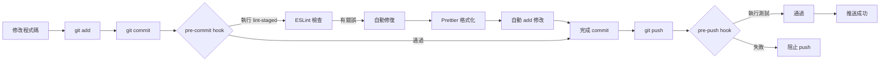

# 🛠️ 開發體驗改善任務

優先級：**P2** | 預計時間：**3-5 天**

## 1. 加入 Prettier 格式化工具

**狀態**：⏳ 待處理

### 問題描述

目前專案缺少統一的程式碼格式化工具：

- ❌ 程式碼風格不一致（縮排、引號、分號等）
- ❌ 團隊協作時容易產生格式衝突
- ❌ Code Review 時浪費時間在格式問題上
- ❌ 手動格式化費時費力

**現況**：
- 僅有 ESLint 進行語法檢查
- 缺少自動格式化工具
- 不同開發者使用不同編輯器設定

### 影響範圍

- 👥 **團隊協作**：程式碼風格不統一
- ⏱️ **開發效率**：手動調整格式浪費時間
- 🔍 **Code Review**：需要關注格式問題
- 🐛 **Git 衝突**：格式差異造成不必要的衝突

### 解決方案

安裝並配置 Prettier，統一程式碼格式化標準。

### 實作步驟

#### 1. 安裝依賴

```bash
npm install -D prettier eslint-config-prettier eslint-plugin-prettier
```

**套件說明**：
- `prettier` - 程式碼格式化工具
- `eslint-config-prettier` - 關閉與 Prettier 衝突的 ESLint 規則
- `eslint-plugin-prettier` - 將 Prettier 作為 ESLint 規則執行

#### 2. 創建 `.prettierrc.json` 配置

```json
{
  "semi": false,
  "singleQuote": true,
  "tabWidth": 2,
  "useTabs": false,
  "trailingComma": "es5",
  "printWidth": 100,
  "arrowParens": "always",
  "endOfLine": "lf",
  "vueIndentScriptAndStyle": false
}
```

#### 3. 創建 `.prettierignore` 忽略文件

```
# 依賴
node_modules
.nuxt
.output
dist

# 建置產物
*.min.js
*.min.css

# 靜態資源
public/

# 鎖定文件
package-lock.json
pnpm-lock.yaml
yarn.lock

# 環境文件
.env
.env.*
```

#### 4. 更新 `.eslintrc.cjs` 整合 Prettier

```javascript
module.exports = {
  root: true,
  extends: [
    '@nuxt/eslint-config',
    'plugin:prettier/recommended' // 加入這行
  ],
  rules: {
    'vue/max-attributes-per-line': 'off',
    'vue/multi-word-component-names': 'off',
    'prettier/prettier': 'warn' // Prettier 錯誤顯示為警告
  }
}
```

#### 5. 更新 `package.json` 新增腳本

```json
{
  "scripts": {
    "dev": "nuxi dev",
    "build": "nuxi build",
    "generate": "nuxi generate",
    "preview": "nuxi preview",
    "lint": "eslint .",
    "lint:fix": "eslint . --fix",
    "format": "prettier --write \"**/*.{js,ts,vue,json,md}\"",
    "format:check": "prettier --check \"**/*.{js,ts,vue,json,md}\""
  }
}
```

#### 6. VSCode 設定（建議）

創建 `.vscode/settings.json`：

```json
{
  "editor.formatOnSave": true,
  "editor.defaultFormatter": "esbenp.prettier-vscode",
  "editor.codeActionsOnSave": {
    "source.fixAll.eslint": true
  },
  "[vue]": {
    "editor.defaultFormatter": "esbenp.prettier-vscode"
  },
  "[javascript]": {
    "editor.defaultFormatter": "esbenp.prettier-vscode"
  },
  "[typescript]": {
    "editor.defaultFormatter": "esbenp.prettier-vscode"
  },
  "[json]": {
    "editor.defaultFormatter": "esbenp.prettier-vscode"
  }
}
```

更新 `.vscode/extensions.json`：

```json
{
  "recommendations": [
    "antfu.vite",
    "nuxt.mdc",
    "vue.volar",
    "esbenp.prettier-vscode",
    "dbaeumer.vscode-eslint"
  ]
}
```

#### 7. 格式化現有程式碼

```bash
# 檢查格式問題
npm run format:check

# 自動格式化所有檔案
npm run format
```

### 配置選項說明

| 選項 | 值 | 說明 |
|------|------|------|
| `semi` | `false` | 不使用分號 |
| `singleQuote` | `true` | 使用單引號 |
| `tabWidth` | `2` | 縮排為 2 空格 |
| `useTabs` | `false` | 使用空格而非 Tab |
| `trailingComma` | `es5` | ES5 支援的地方加尾逗號 |
| `printWidth` | `100` | 每行最多 100 字元 |
| `arrowParens` | `always` | 箭頭函數參數加括號 |
| `endOfLine` | `lf` | 使用 LF 換行符 |
| `vueIndentScriptAndStyle` | `false` | Vue 檔案不縮排 script/style |

### 使用方式

#### 命令列
```bash
# 格式化所有檔案
npm run format

# 檢查格式（不修改）
npm run format:check

# 格式化特定檔案
npx prettier --write "components/**/*.vue"
```

#### VSCode
- 儲存時自動格式化（需安裝 Prettier 擴充）
- 手動格式化：`Shift + Alt + F`（Windows/Linux）或 `Shift + Option + F`（Mac）

#### Git 整合
配合 husky（下個任務），在 commit 前自動格式化

### 驗證方式

- [ ] 執行 `npm run format:check` 無錯誤
- [ ] VSCode 儲存時自動格式化
- [ ] 所有 `.vue`, `.ts`, `.js` 檔案格式一致
- [ ] ESLint 和 Prettier 無衝突
- [ ] 團隊成員都能正常使用

### 相關檔案

- [.prettierrc.json](../.prettierrc.json) - Prettier 配置（新建）
- [.prettierignore](../.prettierignore) - 忽略文件（新建）
- [.eslintrc.cjs](../.eslintrc.cjs) - ESLint 配置（修改）
- [.vscode/settings.json](../.vscode/settings.json) - VSCode 設定（新建）
- [package.json](../package.json) - 腳本配置（修改）

### 參考資料

- [Prettier 官方文檔](https://prettier.io/docs/en/index.html)
- [Prettier Options](https://prettier.io/docs/en/options.html)
- [ESLint + Prettier 整合](https://prettier.io/docs/en/integrating-with-linters.html)

---

## 2. 設置 pre-commit hooks

**狀態**：⏳ 待處理

### 問題描述

目前沒有 Git commit 前的程式碼檢查機制：

- ❌ 可能 commit 未格式化的程式碼
- ❌ 可能 commit 有 lint 錯誤的程式碼
- ❌ 沒有自動化的品質把關
- ❌ 問題到了 CI/CD 才發現

### 影響範圍

- 🐛 **程式碼品質**：低品質程式碼進入版本庫
- ⏱️ **CI/CD 時間**：建置失敗浪費時間
- 👥 **團隊效率**：問題修復成本高

### 解決方案

使用 `husky` + `lint-staged` 在 Git commit 前自動執行檢查和格式化。

### 實作步驟

#### 1. 安裝依賴

```bash
npm install -D husky lint-staged
```

#### 2. 初始化 husky

```bash
# 初始化 husky
npx husky init

# 會創建 .husky/ 目錄和 pre-commit hook
```

#### 3. 配置 lint-staged

在 `package.json` 中加入：

```json
{
  "lint-staged": {
    "*.{js,ts,vue}": [
      "eslint --fix",
      "prettier --write"
    ],
    "*.{json,md}": [
      "prettier --write"
    ]
  }
}
```

#### 4. 設置 pre-commit hook

編輯 `.husky/pre-commit`：

```bash
#!/usr/bin/env sh
. "$(dirname -- "$0")/_/husky.sh"

npx lint-staged
```

#### 5. 更新 package.json 腳本

```json
{
  "scripts": {
    "dev": "nuxi dev",
    "build": "nuxi build",
    "generate": "nuxi generate",
    "preview": "nuxi preview",
    "lint": "eslint .",
    "lint:fix": "eslint . --fix",
    "format": "prettier --write \"**/*.{js,ts,vue,json,md}\"",
    "format:check": "prettier --check \"**/*.{js,ts,vue,json,md}\"",
    "prepare": "husky install"
  }
}
```

#### 6. 測試 pre-commit hook

```bash
# 修改一個檔案（故意破壞格式）
echo "const test = { a: 1 }" >> test.js

# 加入暫存區
git add test.js

# 嘗試 commit
git commit -m "test: pre-commit hook"

# 應該會自動格式化並重新 commit
```

### 配置選項

#### lint-staged 進階配置

```json
{
  "lint-staged": {
    "*.{js,ts,vue}": [
      "eslint --fix",
      "prettier --write"
    ],
    "*.{json,md,yml,yaml}": [
      "prettier --write"
    ],
    "*.vue": [
      "eslint --fix",
      "prettier --write",
      "git add"
    ],
    "package.json": [
      "prettier --write"
    ]
  }
}
```

#### 其他有用的 Git hooks

**commit-msg** - 檢查 commit 訊息格式：

創建 `.husky/commit-msg`：

```bash
#!/usr/bin/env sh
. "$(dirname -- "$0")/_/husky.sh"

npx --no -- commitlint --edit $1
```

需要安裝並配置 commitlint：

```bash
npm install -D @commitlint/cli @commitlint/config-conventional
```

創建 `commitlint.config.js`：

```javascript
module.exports = {
  extends: ['@commitlint/config-conventional'],
  rules: {
    'type-enum': [
      2,
      'always',
      [
        'feat',     // 新功能
        'fix',      // 修復
        'docs',     // 文檔
        'style',    // 格式
        'refactor', // 重構
        'test',     // 測試
        'chore',    // 雜項
        'perf',     // 效能
        'ci',       // CI/CD
      ],
    ],
  },
}
```

**pre-push** - push 前執行測試：

創建 `.husky/pre-push`：

```bash
#!/usr/bin/env sh
. "$(dirname -- "$0")/_/husky.sh"

npm run lint
npm run build
```

### Workflow 流程



### 跳過 hooks（緊急情況）

```bash
# 跳過 pre-commit hook
git commit --no-verify -m "urgent fix"

# 跳過 pre-push hook
git push --no-verify
```

⚠️ **注意**：除非緊急情況，否則不建議跳過 hooks

### 團隊協作設定

#### 1. 確保所有人安裝 husky

每位開發者在 clone 專案後執行：

```bash
npm install
npm run prepare  # 自動安裝 husky hooks
```

#### 2. 更新 README.md 說明

在 README 中加入：

```markdown
## 開發環境設置

1. 安裝依賴
   \`\`\`bash
   npm install
   \`\`\`

2. 安裝 Git hooks（自動執行）
   \`\`\`bash
   npm run prepare
   \`\`\`

3. 驗證 hooks 是否安裝
   \`\`\`bash
   ls .husky
   # 應該看到 pre-commit 等檔案
   \`\`\`
```

### 驗證方式

- [ ] 執行 `npm run prepare` 成功
- [ ] `.husky/pre-commit` 檔案存在且可執行
- [ ] commit 時自動執行 lint 和格式化
- [ ] 格式錯誤會被自動修正
- [ ] lint 錯誤會阻止 commit
- [ ] 團隊成員都能正常使用

### 故障排除

#### Q: Git hooks 沒有執行？

```bash
# 檢查 hook 是否可執行
ls -la .husky/pre-commit

# 設置執行權限
chmod +x .husky/pre-commit

# 重新安裝 husky
rm -rf .husky
npx husky install
```

#### Q: Windows 上 hook 無法執行？

確保使用 Git Bash 或 WSL，並設定：

```bash
git config core.autocrlf false
git config core.eol lf
```

### 相關檔案

- [.husky/pre-commit](../.husky/pre-commit) - Git hook（新建）
- [package.json](../package.json) - lint-staged 配置（修改）
- [.gitignore](../.gitignore) - 確認 .husky 未被忽略

### 參考資料

- [Husky 官方文檔](https://typicode.github.io/husky/)
- [lint-staged](https://github.com/okonet/lint-staged)
- [Commitlint](https://commitlint.js.org/)

---

## 3. 優化 GitHub Actions CI/CD

**狀態**：⏳ 待處理

### 問題描述

當前 GitHub Actions 工作流程效能不佳：

- ❌ 每次都重新下載 node_modules（耗時 1-2 分鐘）
- ❌ 使用 npm（較慢），未使用 pnpm（更快）
- ❌ 缺少建置快取
- ❌ 缺少並行執行
- ❌ Node.js 版本固定在 18（可升級到 20 LTS）

**現況建置時間**：
- Build workflow: ~3-4 分鐘
- Deploy workflow: ~4-5 分鐘

### 影響範圍

- ⏱️ **開發效率**：CI/CD 時間過長
- 💰 **成本**：浪費 GitHub Actions 分鐘數
- 🔄 **回饋循環**：問題發現延遲

### 解決方案

1. 使用 pnpm 替代 npm
2. 加入依賴快取
3. 優化工作流程
4. 升級 Node.js 版本

### 實作步驟

#### 1. 轉換到 pnpm

**安裝 pnpm（本地）**：

```bash
npm install -g pnpm

# 遷移專案
pnpm import  # 從 package-lock.json 生成 pnpm-lock.yaml
pnpm install
```

**更新 package.json**：

```json
{
  "packageManager": "pnpm@8.15.0",
  "engines": {
    "node": ">=18.0.0",
    "pnpm": ">=8.0.0"
  }
}
```

#### 2. 優化 build.yml

```yaml
name: Build Nuxt Application

on:
  workflow_dispatch:
  pull_request:

jobs:
  build:
    runs-on: ubuntu-latest
    steps:
      - name: Checkout
        uses: actions/checkout@v4

      - name: Setup pnpm
        uses: pnpm/action-setup@v2
        with:
          version: 8

      - name: Setup Node.js
        uses: actions/setup-node@v4
        with:
          node-version: '20'
          cache: 'pnpm'

      - name: Install dependencies
        run: pnpm install --frozen-lockfile

      - name: Lint
        run: pnpm run lint

      - name: Build
        run: |
          echo "BASE_URL=/${{ github.event.repository.name }}" >> .env
          pnpm run generate

      - name: Upload artifact
        uses: actions/upload-artifact@v3
        with:
          name: dist
          path: .output/public
          retention-days: 1
```

#### 3. 優化 deploy.yml

```yaml
name: Build and Deploy Github Page

on:
  workflow_dispatch:
  push:
    branches:
      - master

# 允許同時只有一個部署任務
concurrency:
  group: pages
  cancel-in-progress: true

jobs:
  build:
    runs-on: ubuntu-latest
    steps:
      - name: Checkout
        uses: actions/checkout@v4

      - name: Setup pnpm
        uses: pnpm/action-setup@v2
        with:
          version: 8

      - name: Setup Node.js
        uses: actions/setup-node@v4
        with:
          node-version: '20'
          cache: 'pnpm'

      - name: Install dependencies
        run: pnpm install --frozen-lockfile

      - name: Generate static site
        run: |
          echo "BASE_URL=/${{ github.event.repository.name }}" >> .env
          pnpm run generate

      - name: Add .nojekyll
        run: touch .output/public/.nojekyll

      - name: Upload artifact
        uses: actions/upload-pages-artifact@v3
        with:
          path: .output/public

  deploy:
    needs: build
    runs-on: ubuntu-latest
    permissions:
      pages: write
      id-token: write
    environment:
      name: github-pages
      url: ${{ steps.deployment.outputs.page_url }}
    steps:
      - name: Deploy to GitHub Pages
        id: deployment
        uses: actions/deploy-pages@v4
```

#### 4. 進階優化 - 矩陣測試（可選）

```yaml
name: CI

on:
  pull_request:
  push:
    branches:
      - master

jobs:
  test:
    runs-on: ${{ matrix.os }}
    strategy:
      matrix:
        os: [ubuntu-latest]
        node: [18, 20]
      fail-fast: false

    steps:
      - uses: actions/checkout@v4

      - name: Setup pnpm
        uses: pnpm/action-setup@v2

      - name: Setup Node.js ${{ matrix.node }}
        uses: actions/setup-node@v4
        with:
          node-version: ${{ matrix.node }}
          cache: 'pnpm'

      - name: Install
        run: pnpm install --frozen-lockfile

      - name: Lint
        run: pnpm run lint

      - name: Build
        run: pnpm run generate
```

#### 5. 加入建置快取

```yaml
- name: Cache Nuxt
  uses: actions/cache@v3
  with:
    path: |
      .nuxt
      .output
    key: ${{ runner.os }}-nuxt-${{ hashFiles('pnpm-lock.yaml') }}
    restore-keys: |
      ${{ runner.os }}-nuxt-
```

### 優化效果預期

| 項目 | 優化前 | 優化後 | 改善 |
|------|--------|--------|------|
| 依賴安裝 | ~90s | ~20s | -78% |
| 建置時間 | ~180s | ~120s | -33% |
| 總執行時間 | ~300s | ~150s | -50% |
| 快取命中率 | 0% | ~80% | +80% |

### pnpm vs npm 比較

| 特性 | npm | pnpm |
|------|-----|------|
| 安裝速度 | 較慢 | 快 2-3 倍 |
| 磁碟空間 | 大 | 節省 ~50% |
| node_modules | 扁平化 | 符號連結 |
| 嚴格性 | 寬鬆 | 嚴格（更安全） |

### 遷移檢查清單

#### 本地開發
- [ ] 安裝 pnpm
- [ ] 執行 `pnpm import`
- [ ] 執行 `pnpm install`
- [ ] 測試所有指令正常運作
- [ ] 刪除 `package-lock.json`
- [ ] 提交 `pnpm-lock.yaml`

#### CI/CD
- [ ] 更新 build.yml
- [ ] 更新 deploy.yml
- [ ] 測試 PR 建置
- [ ] 測試部署流程
- [ ] 驗證快取機制

#### 文檔更新
- [ ] 更新 README.md（使用 pnpm）
- [ ] 更新 CLAUDE.md
- [ ] 通知團隊成員

### 團隊協作

**更新 README.md**：

```markdown
## 開發環境要求

- Node.js 18 或更高版本
- pnpm 8 或更高版本

## 安裝

\`\`\`bash
# 安裝 pnpm（如果尚未安裝）
npm install -g pnpm

# 安裝專案依賴
pnpm install
\`\`\`

## 開發指令

\`\`\`bash
pnpm dev          # 啟動開發伺服器
pnpm build        # 建置應用程式
pnpm generate     # 生成靜態網站
pnpm lint         # 執行 linting
pnpm format       # 格式化程式碼
\`\`\`
```

### 驗證方式

- [ ] pnpm 指令正常運作
- [ ] GitHub Actions 建置成功
- [ ] 快取機制生效（查看 Actions 日誌）
- [ ] 建置時間明顯減少
- [ ] 部署成功
- [ ] 團隊成員都能正常開發

### 回退方案

如果 pnpm 出現問題：

```bash
# 回到 npm
rm -rf node_modules pnpm-lock.yaml
npm install

# 恢復 GitHub Actions 配置
git checkout .github/workflows/
```

### 相關檔案

- [.github/workflows/build.yml](../.github/workflows/build.yml) - 建置工作流程
- [.github/workflows/deploy.yml](../.github/workflows/deploy.yml) - 部署工作流程
- [package.json](../package.json) - 套件管理器配置
- [pnpm-lock.yaml](../pnpm-lock.yaml) - pnpm 鎖定檔案（新建）

### 參考資料

- [pnpm 官方文檔](https://pnpm.io/)
- [pnpm/action-setup](https://github.com/pnpm/action-setup)
- [GitHub Actions - Caching](https://docs.github.com/en/actions/using-workflows/caching-dependencies-to-speed-up-workflows)
- [setup-node - Caching packages data](https://github.com/actions/setup-node#caching-global-packages-data)

---

## 完成檢查清單

### Task 1: Prettier
- [ ] 安裝 Prettier 相關套件
- [ ] 創建 .prettierrc.json
- [ ] 創建 .prettierignore
- [ ] 更新 .eslintrc.cjs
- [ ] 創建 VSCode 設定
- [ ] 格式化現有程式碼
- [ ] 測試格式化功能
- [ ] 提交變更

### Task 2: Pre-commit Hooks
- [ ] 安裝 husky 和 lint-staged
- [ ] 初始化 husky
- [ ] 配置 lint-staged
- [ ] 設置 pre-commit hook
- [ ] 測試 commit 流程
- [ ] （可選）設置 commit-msg hook
- [ ] （可選）設置 pre-push hook
- [ ] 更新 README 說明
- [ ] 提交變更

### Task 3: CI/CD 優化
- [ ] 本地安裝 pnpm
- [ ] 執行 pnpm import
- [ ] 測試 pnpm 指令
- [ ] 更新 build.yml
- [ ] 更新 deploy.yml
- [ ] 刪除 package-lock.json
- [ ] 提交 pnpm-lock.yaml
- [ ] 測試 GitHub Actions
- [ ] 驗證建置時間改善
- [ ] 更新文檔

---

**預計完成時間**：3-5 個工作天
**優先級**：🛠️ 中
**影響範圍**：開發效率 + 程式碼品質 + CI/CD 效能
